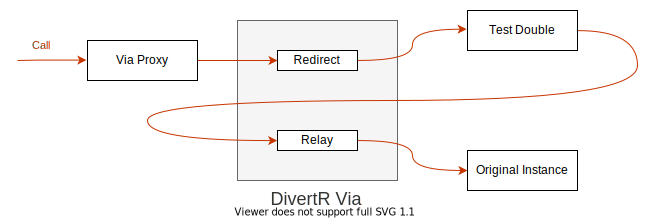

# DivertR

.NET Dependency Injection Diversion

[](https://www.nuget.org/packages/DivertR)
[](https://github.com/devodo/DivertR/actions/workflows/build.yml)

DivertR is similar to well known mocking frameworks like Moq or FakeItEasy but provides additional features for directly manipulating your registered dependency injection services.
This facilitates an integrated approach to testing by making it easy to hotswap test code in and out at the DI layer.



With DivertR you can modify your DI services at runtime by replacing them with configurable proxies.
These can redirect calls to test doubles, such as substitute instances, mocks or delegates, and then optionally relay back to the original services.
Update and reset proxy configurations, on the fly, while the process is running.

## Installing

Install DivertR as a [NuGet package](https://www.nuget.org/packages/DivertR):

    Install-Package DivertR

Or via the .NET command line interface:

    dotnet add package DivertR

## Code overview

### Start with a Foo

Given an `IFoo` interface and a `Foo` implementation:

```csharp
public interface IFoo
{
    public string Name { get; set; }
    string Echo(string input);
}

public class Foo : IFoo
{
    public string Name { get; set; } = "Foo";
    
    public string Echo(string input)
    {
        return $"{Name}: {input}";
    }
}
```

With the following .NET `Microsoft.Extensions.DependencyInjection.IServiceCollection` registration:

```csharp
IServiceCollection services = new ServiceCollection();
services.AddTransient<IFoo, Foo>();
services.AddSingleton<IExample, Example>(); // some other example registration
```

### Instantiate DivertR

Create a DivertR instance and register one or more DI service types of interest:

```csharp
var diverter = new Diverter()
    .Register<IFoo>()
    .Register<IExample>();
```

The registered DivertR types are installed into the `IServiceCollection` by decorating existing DI registrations using a provided extension method:

```csharp    
services.Divert(diverter);
```

The `IServiceCollection` can now be used as usual to build the service provider and resolve dependency instances:

```csharp
IServiceProvider provider = services.BuildServiceProvider();
IFoo foo = provider.GetService<IFoo>();

Console.WriteLine(foo.Echo("Hello")); // "Foo: Hello"
```

### Redirect

At this stage the behaviour of the resolved `IFoo` instances is unchanged. However, it can be modified using 
a DivertR entity called a `Via` to configure a *redirect*:

```csharp
IVia<IFoo> fooVia = diverter.Via<IFoo>();
fooVia
    .To(x => x.Echo(Is<string>.Any))                // (1)
    .Redirect(call => $"{call.Args[0]} DivertR");   // (2)
  
Console.WriteLine(foo.Echo("Hello")); // "Hello DivertR"
```

The `Via` intercepts calls to the resolved `IFoo` instances.
By default calls are simply forwarded to the original registration, in this case instances of the `Foo` class.
However, after adding the redirect any calls that match the lambda expression (1) are redirected to the delegate (2).

The call's arguments can be accessed from the `call.Args` property as an `object[]`.
However DivertR lets you optionally provide strongly typed named arguments using a ValueTuple type as follows:

```csharp
IVia<IFoo> fooVia = diverter.Via<IFoo>();
fooVia
    .To(x => x.Echo(Is<string>.Any))                                      // (1)
    .Redirect<(string input, __)>(call => $"{call.Args.input} DivertR");  // (2)
  
Console.WriteLine(foo.Echo("Hello")); // "Hello DivertR"
```

> The `call.Args` property is replaced with an instance of the given ValueTuple type `(string intput, __)`.

C# requires named ValueTuples to have at least two parameters. If the call only has a single parameter, as in the example above,
then a dummy second parameter must be provided using the special Diverter type `__`.

Once a redirect is added it will be applied to all existing and future resolved `IFoo` instances. For example if a second `IFoo` instance is resolved:

```csharp
IFoo foo2 = provider.GetService<IFoo>();
foo2.Name = "Foo2";

Console.WriteLine(foo2.Echo("Hello")); // "Hello DivertR"
```

### Reset

To reset resolved instances back to their original behaviour simply discard all redirects on the `Via` with the following call:

```csharp
fooVia.Reset();
  
Console.WriteLine(foo.Echo("Hello"));  // "Foo: Hello"
Console.WriteLine(foo2.Echo("Hello")); // "Foo2: Hello"
```

So far we have only been working with a single `Via` instance, i.e. `IVia<IFoo>` bound to the `IFoo` registration type.
However, testing a system would typically require using multiple `Vias` for different types.
These can all be reset at once by calling: 

```csharp
diverter.ResetAll();
```

### Relay

The `Via` also lets you *relay* back to the original or *root* registration
by providing the `Relay.Root` property that can be called from the body of the redirect:

```csharp
fooVia
    .To(x => x.Echo(Is<string>.Any))
    .Redirect<(string input, __)>(call =>
    {
        // run test code before
        // ...

        // call root instance
        var root = call.Relay.Root;
        var message = root.Echo(call.Args.input);
    
        // run test code after
        // ...
    
        return $"{message} Redirect";
    });
  
Console.WriteLine(foo.Echo("Hello"));  // "Foo: Hello Redirect"
Console.WriteLine(foo2.Echo("Hello")); // "Foo2: Hello Redirect"
```

> The `Relay.Root` property is a proxy that the `Via` connects to the current intercepted call.
> Its members can only be accessed within the context of the intercepted call otherwise a `DiverterException` is thrown.

### Retarget

As well as redirecting to delegates you can also retarget to substitutes that implement the target interface (in this case `IFoo`).
This includes, for example, Mock objects:

```csharp
IFoo root = fooVia.Relay.Root;
var mock = new Mock<IFoo>();
mock
    .Setup(x => x.Echo(It.IsAny<string>()))
    .Returns((string input) => $"{root.Echo(input)} Mock");

fooVia
    .To() // No parameter defaults to match all calls
    .Retarget(mock.Object);

Console.WriteLine(foo.Echo("Hello"));  // "Foo: Hello Mock"
Console.WriteLine(foo2.Echo("Hello")); // "Foo2: Hello Mock"
```

Note the substitute/mock can also use the `Relay.Root` proxy to call the original by conveniently accessing it as a property directly from the `Via` instance.
DivertR uses an ambient `AsyncLocal` context for this so it always points to the *root* of the current call.

### Interfaces only

By default DivertR can only be used on interface types. Classes are not supported as calls to non-virtual members
cannot be intercepted, causing inconsistent and confusing behaviour.

### Async support

Task and ValueTask async calls are fully supported, e.g. if `IFoo` is extended to include an async method:

```csharp
public interface IFoo
{
    Task<string> EchoAsync(string input);
}

public class Foo : IFoo
{
    public async Task<string> EchoAsync(string input)
    {
        await Task.Yield();
        return $"{Name}: {input}";
    }
}

fooVia
    .To(x => x.EchoAsync(Is<string>.Any))
    .Redirect<(string input, __)>(async call => $"{await call.Relay.Root.EchoAsync(call.Args.input)} Async");

Console.WriteLine(await foo.EchoAsync("Hello"));  // "Foo: Hello Async"
Console.WriteLine(await foo2.EchoAsync("Hello")); // "Foo2: Hello Async"
```

### WebApplicationFactory example

DivertR was originally created to facilitate in-process integration/component testing using the excellent
[WebApplicationFactory framework](https://docs.microsoft.com/en-us/aspnet/core/test/integration-tests) in-memory ASP.NET test server.
WebApplicationFactory allows DI service customisation but this can only be done once at startup per server instance.

With DivertR it is easy and efficient to modify DI customisations between tests running against the same test server instance
as illustrated by the following [WebApp Testing Sample](https://github.com/devodo/DivertR/tree/main/test/DivertR.WebAppTests).
