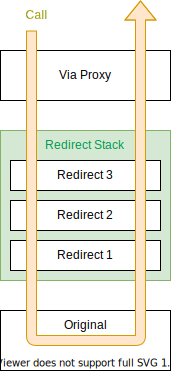

# Developer guide

DivertR is a testing framework that can be used to dynamically manipulate your dependency injection services.
It works by decorating existing DI registrations to resolve proxies instead that wrap the original instances.
Calls are then intercepted by these proxies and they can be configured to divert them to test doubles such as substitutes, mocks or delegates.
The test doubles are also able to conveniently call back into the original instances.


The proxies are created and controlled by a DivertR entity called a `Via`. The default proxy behaviour
is to simply relay all intercepted calls directly through to the original instances. This means that
by default DivertR does not change the behaviour of the system.

To modify the proxy behaviour the `Via` is used to add a `Redirect` that can intercept the call and pass
it on to a test double that is any substitute that implements the original interface (including Mock objects) or a delegate.

The `Via` provides a `Relay` interface that can be used by test doubles to conveniently call back into the original instances.
Finally the `Via` can be `Reset` any time removing all `Redirect` configurations and reverting back to the
default behaviour of relaying directly to the original.

# Usage

## Example ServiceCollection

The instructions in this guide will use the following .NET `Microsoft.Extensions.DependencyInjection.IServiceCollection` registration:

```csharp
IServiceCollection services = new ServiceCollection();
services.AddTransient<IFoo, Foo>();
services.AddTransient<IBar, Bar>();
```

The registered interfaces and their implementation are:

```csharp
public interface IFoo
{
    string Name { get; set; }
    string Echo(string input);
    Task<string> EchoAsync(string input);
    T EchoGeneric<T>(T input);
}

public interface IBar
{
    IFoo Foo { get; }
}

public class Foo : IFoo
{
    public string Name { get; set; } = "original";

    public string Echo(string input)
    {
        return $"{Name}: {input}";
    }

    public async Task<string> EchoAsync(string input)
    {
        await Task.Yield();
        return $"{Name}: {input}";
    }

    public T EchoGeneric<T>(T input)
    {
        return input;
    }
}

public class Bar : IBar
{
    public Bar(IFoo foo)
    {
        Foo = foo;
    }
    
    public IFoo Foo { get; }
}
```

## DivertR

### Register

First instantiate a `Diverter` instance and register types you want to manipulate as follows:

```csharp
IDiverter diverter = new Diverter();
diverter.Register<IFoo>();
diverter.Register<IBar>();
```

Or more conveniently: 

```csharp
var diverter = new Diverter()
    .Register<IFoo>()
    .Register<IBar>();
```

Or:

```csharp
var diverter = new Diverter().Register(new[]
    {
        typeof(IFoo), typeof(IBar)
    });
```

### Install

The registered DivertR types are installed into the `IServiceCollection` using a provided extension method:

```csharp
services.Divert(diverter);
```

This decorates the existing DI registrations, turning them into `Via` proxy factories.


The behaviour Redirect added.
The `Via` also allows diverted calls to conveniently call back into the original instances.
DivertR makes available *relay* proxies that reference the .
Calls to the original instances can be redirected and relayed back to the original instances


DivertR is a proxy interception framework built on top of DispatchProxy that
Similar to mocking frameworks like Moq lets you manipulate Dependency Injection
services by decorating registrations with configurable proxies. These proxies
share a lot of similarities 

In process integration and component testing 

Note the Mock also calls the `Relay.Next` property. However, it does not relay to the original registration as before.
Instead it goes to the delegate redirect that was previously added.
This is because adding a new redirect does not replace the existing ones. Instead they are pushed onto a stack
that the `Relay.Next` property traverses...

### Redirect chain



When redirects are added they are pushed onto a stack. When the `Via` intercepts a call
it traverses down the stack, starting from the last redirect added. The call is passed to the first eligible redirect (e.g. its lambda expression constraint matches).
The redirect is then responsible for executing the call and can optionally continue back down the stack by calling the `Relay.Next` property. This will again traverse the stack
until the next matching redirect is found. When there are no more redirects the original instance is called.
> In summary, the redirects are stacked forming a chain of responsibility pipeline that is
> traversed with the `Relay.Next` property.

### Original relay

The `Via` also provides the `Relay.Original` property that relays directly to the original instance,
skipping over any remaining redirects.

```csharp
IFoo original = fooVia.Relay.Original;
fooVia
    .To(x => x.Echo(Is<string>.Any))
    .Redirect((string input) => $"{original.Echo(input)} - Skipped");
  
Console.WriteLine(foo.Echo("Hello"));  // "Foo: Hello - Skipped"
Console.WriteLine(foo2.Echo("Hello")); // "Foo2: Hello - Skipped"
```

> Similar to the `Relay.Next` property, `Relay.Original` is a proxy interface that relays to the original instance
> but its members can only be accessed within the context of a `Via` intercepted call.

### Open generic registrations
IServiceCollection supports open generic registrations for example:
services.AddTransient(typeof(IBar<>), typeof(Bar<>);

It is not possible to DivertR let


